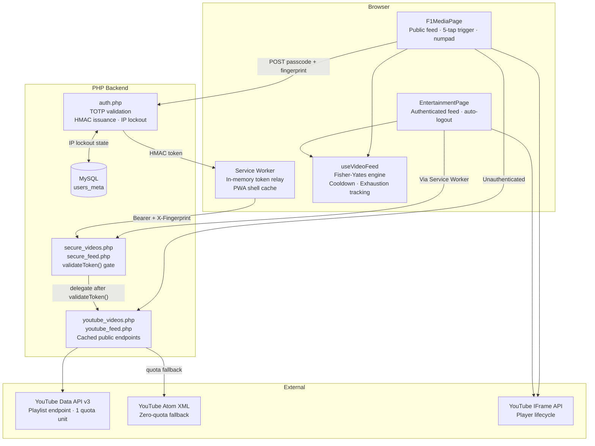

# F1 Media


A TikTok-style vertical video feed for Formula 1 content. Posts scroll full-screen. Videos autoplay and loop. The feed is driven by a Fisher-Yates shuffle engine that pulls from 13 curated F1 channels via the YouTube Data API v3, with an Atom XML fallback when the API quota is exhausted.

The public face serves F1 content without authentication. Behind a hidden trigger, an HMAC-authenticated layer extends the catalogue to 113 channels across a dozen content categories. The authentication gateway, IP lockout logic, and token relay all operate entirely within the PHP backend and a Service Worker: no credentials ever touch `localStorage` or `IndexedDB`.

---

## What It Does

**Public layer (F1 Media):**

- Full-screen, autoplay, looping video feed backed by a live YouTube IFrame Player instance per card.
- Four content categories (Everything, Race Room, Pit Wall, Banter) drawn from 13 curated Formula 1 channels.
- Fisher-Yates shuffle with a per-session seed offset. Each browser session produces a different ordering. A channel cooldown algorithm prevents the same source from appearing in consecutive posts.
- Feed capped at 80 posts. When the cap is reached, the oldest 20 are discarded and replaced with fresh content. Memory stays bounded regardless of session length.
- Progressive Web App. Installable on iOS and Android. Offline shell served from a Service Worker cache keyed to the build ID.

**Authentication:**

- A hidden 5-tap trigger on the logo opens a numeric keypad.
- The passcode is date-based: the current date formatted as `ddmmyyyy` in the user's local timezone. It changes at midnight. A one-hour grace window around the transition accepts either the current or preceding day's code, preventing lockout during timezone edge cases.
- Three failed attempts lock the originating IP for 24 hours. IP addresses are stored as HMAC-SHA256 hashes: raw IPs never persist.
- On success, a HMAC-SHA256 token is issued: `hash_hmac('sha256', fingerprint + serverDate, TOKEN_SALT)`. The token is sent to the Service Worker via `postMessage` and held in plain module-scope variables. It never leaves the worker process.

**Authenticated layer:**

- 113 channels across 12 categories: motorsport, technology, food, gaming, travel, comedy, entertainment, news, and others.
- All API requests from the authenticated layer route through two thin wrapper endpoints (`secure_videos.php`, `secure_feed.php`). Each calls `validateToken()` before delegating to the base endpoints.
- The Service Worker intercepts every `/api/` request and injects `Authorization: Bearer <token>` and `X-Fingerprint: <fingerprint>` headers automatically. The React application makes no direct token management calls post-authentication.
- Switching tabs or backgrounding the app triggers `visibilitychange`, which clears the session immediately and returns the user to the public face.

---

## Architecture



Full technical reference: [docs/ARCHITECTURE.md](docs/ARCHITECTURE.md)

---

## Requirements

| Component | Minimum |
|---|---|
| Node.js | 18+ (build only) |
| PHP | 8.0 |
| MySQL | 5.7+ / MariaDB 10.3+ |
| YouTube Data API v3 key | Required for primary feed |
| Browser | Chrome 90+, Firefox 90+, Safari 15+, Edge 90+ |

---

## Quick Start

**1. Clone the repository.**

```bash
git clone https://github.com/nshah1d/f1-media.git
cd f1-media
```

**2. Create the database table.**

```bash
mysql -u <user> -p <database> < schema.sql
```

**3. Configure the environment.**

```bash
cp .env.example .env
```

Open `.env` and set all six values:

```
DB_HOST=localhost
DB_USER=your_db_user
DB_PASS=your_db_password
DB_NAME=your_db_name
TOKEN_SALT=your_random_salt_minimum_32_chars
YOUTUBE_API_KEY=your_youtube_data_api_v3_key
```

`TOKEN_SALT` must be a random string of at least 32 characters. It signs every HMAC token and IP hash. Changing it after deployment invalidates all existing sessions and IP lockout records.

**4. Build the frontend.**

```bash
npm install
npm run build
```

**5. Deploy.**

Upload the contents of `dist/` to the web root of any PHP 8-enabled Apache server. Upload `api/`, `includes/`, `.htaccess`, and `.env` alongside it. The `.htaccess` file handles SPA routing and passes the `Authorization` header through to PHP.

Full deployment reference: [docs/CONFIGURATION.md](docs/CONFIGURATION.md)

---

## Directory Layout

```
f1-media/
│
├── api/
│   ├── auth.php            # Passcode validation, HMAC issuance, IP lockout
│   ├── config.php          # .env loader, defines DB_* and TOKEN_SALT constants
│   ├── secure_feed.php     # Authenticated wrapper: validateToken() → youtube_feed.php
│   ├── secure_videos.php   # Authenticated wrapper: validateToken() → youtube_videos.php
│   ├── youtube_feed.php    # Atom XML fallback: 15 videos, 1-hour cache
│   └── youtube_videos.php  # Primary: YouTube Data API v3, 50 videos, 24-hour cache
│
├── includes/
│   ├── auth_check.php      # validateToken(): Bearer token + fingerprint verification
│   └── db.php              # PDO singleton
│
├── public/
│   ├── sw.js               # Service Worker: token relay, shell cache, cache-busting
│   └── manifest.json       # PWA manifest
│
├── src/
│   ├── App.jsx             # Root: dual-layer view state ('f1' | 'entertainment')
│   ├── components/
│   │   └── entertainment/
│   │       ├── VideoCard.jsx   # YT IFrame Player lifecycle, blocker overlay
│   │       └── VideoFeed.jsx   # IntersectionObserver scroll engine, batch loading
│   ├── config/
│   │   ├── categories.js       # F1_CATEGORIES and HUB_CATEGORIES channel taxonomy
│   │   └── youtube.js          # YT_PLAYER_VARS: autoplay, loop, no controls
│   ├── hooks/
│   │   └── useVideoFeed.js     # Feed engine: Fisher-Yates, cooldown, exhaustion, batching
│   ├── routes/
│   │   ├── F1MediaPage.jsx     # Public face: feed, 5-tap trigger, numpad, ghost input
│   │   └── EntertainmentPage.jsx  # Authenticated layer: auto-logout, token restore
│   └── utils/
│       └── youtube.js          # loadYouTubeAPI() singleton promise
│
├── .env.example            # Template: all six required variables
├── .htaccess               # SPA routing, Authorization header passthrough, security headers
├── index.html              # App shell: SEO metadata, PWA tags, SW registration
├── robots.txt              # Disallows all crawling of hosted instances
├── schema.sql              # users_meta table (UNIQUE INDEX on ip_address)
├── vite.config.js          # Build config: relative base, API proxy, swCacheBust plugin
│
└── docs/
    ├── ARCHITECTURE.md     # Feed engine, auth flow, SW relay, IFrame lifecycle
    └── CONFIGURATION.md    # Environment, database, channels, fork guide
```

---

## Environment Variables

| Variable | Description |
|---|---|
| `DB_HOST` | MySQL host |
| `DB_USER` | MySQL username |
| `DB_PASS` | MySQL password |
| `DB_NAME` | MySQL database name |
| `TOKEN_SALT` | HMAC signing key for tokens and IP hashes. Minimum 32 characters. |
| `YOUTUBE_API_KEY` | YouTube Data API v3 key. Required for the primary feed. |

Full configuration reference: [docs/CONFIGURATION.md](docs/CONFIGURATION.md)

---

## Deployment

The application requires a PHP 8-enabled server with MySQL, Apache mod_rewrite, and the `mod_headers` module active.

The Vite build outputs `dist/`. Deploy its contents to the server web root. The `api/`, `includes/`, and `.htaccess` files must sit alongside the built assets at the same root level. The `.env` file must never be web-accessible: place it one directory above the web root, or restrict it via `.htaccess`.

`robots.txt` ships with `Disallow: /`. Do not remove it from a public-facing deployment.

---

## Security

Full security reference: [SECURITY.md](SECURITY.md)

- **No credentials in persistent storage.** The HMAC token and device fingerprint are held only in Service Worker module-scope variables and `sessionStorage`. Both are cleared on tab close. Neither ever writes to `localStorage` or `IndexedDB`.
- **IP addresses are never stored in plaintext.** Every IP is hashed with `hash_hmac('sha256', ip, TOKEN_SALT)` before any database write.
- **Brute-force protection.** Three failed passcode attempts lock the originating IP for 24 hours (HTTP 423).
- **Auto-logout.** The `visibilitychange` event fires `doLogout()` the moment the authenticated page is hidden, clearing the token and returning the user to the public face.
- **No Content Security Policy.** This is a known deferred gap for the current private deployment. See [SECURITY.md](SECURITY.md) for the proposed header and threat assessment.

---

<div align="center">
<br>

**_Architected by Nauman Shahid_**

<br>

[](https://www.nauman.cc)
[](https://github.com/nshah1d)
[](https://www.linkedin.com/in/nshah1d/)

</div>
<br>

Licensed under the [MIT Licence](LICENSE).
