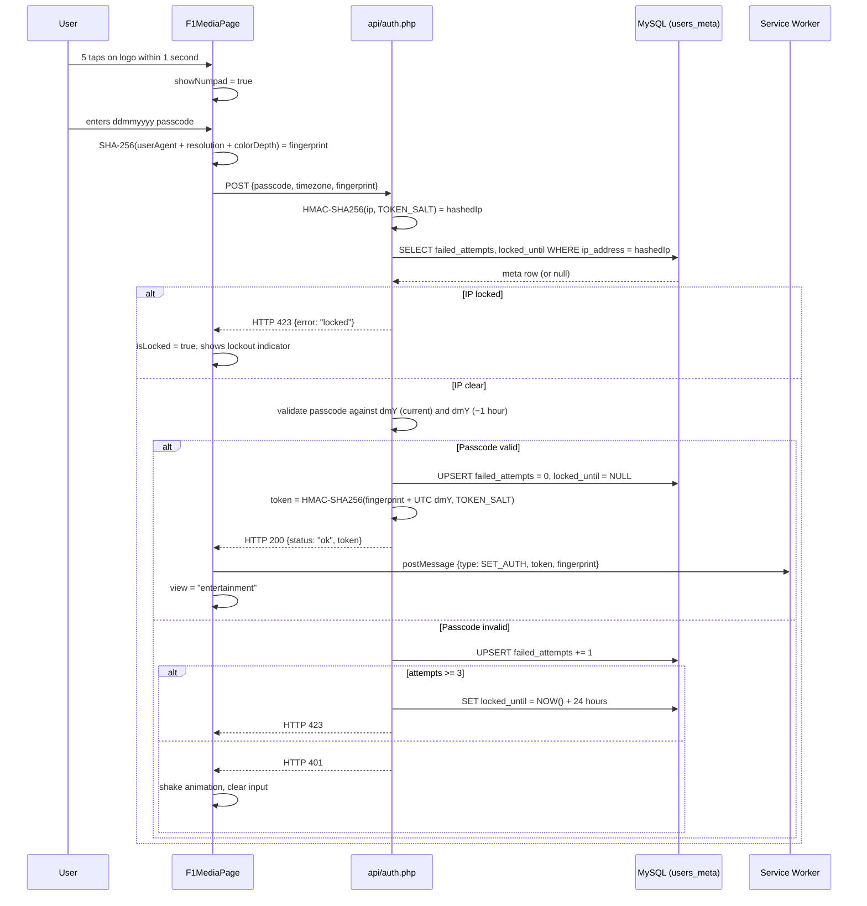

# Architecture Reference

This document covers the technical internals of F1 Media: the dual-layer content model, the authentication and token lifecycle, the Service Worker relay, the feed intelligence engine, the YouTube data layer, and the VideoCard player lifecycle.

---

## Dual-Layer Model

The application has two completely distinct views controlled by a single state variable in `App.jsx`:

```javascript
const [view, setView] = useState('f1');
```

When `view === 'f1'`, the application renders `F1MediaPage`. When `view === 'entertainment'`, it renders `EntertainmentPage`. There is no routing library: the transition is a direct state swap. The public face never mounts when the authenticated layer is active, and vice versa.

A session seed is written to `sessionStorage` once per tab at the top of `App.jsx`, before any component mounts:

```javascript
if (!sessionStorage.getItem('session_seed')) {
  sessionStorage.setItem('session_seed', String(Math.floor(Math.random() * 1000000)));
}
```

This seed is consumed by the feed engine to offset the Fisher-Yates shuffle. Every new tab produces a different ordering.

---

## Authentication Flow



### Passcode Design

The passcode is derived from the current date in the user's local timezone, formatted as `dmY` (e.g., `26042026` for 26 April 2026). `auth.php` computes two valid codes on every request:

```php
$now = new DateTime('now', $clientTz);
$nowMinus1h = clone $now;
$nowMinus1h->modify('-1 hour');

$validCodes = [
    $now->format('dmY'),
    $nowMinus1h->format('dmY'),
];
```

The `-1 hour` clone handles midnight crossover: a user entering at 00:03 with yesterday's code still authenticates successfully, because one hour prior was still the previous day.

### Token Construction

The HMAC token binds the device fingerprint to a server-side UTC date:

```php
$tokenDate = new DateTime('now', new DateTimeZone('UTC'));
$serverDate = $tokenDate->format('dmY');
$token = hash_hmac('sha256', $fingerprint . $serverDate, TOKEN_SALT);
```

The fingerprint is a SHA-256 hash of `userAgent + screenWidth + 'x' + screenHeight + colorDepth`, computed in the browser via `crypto.subtle.digest` before the authentication request is sent. Binding the token to the fingerprint means a captured token is unusable from a different device profile.

### Token Validation

`includes/auth_check.php` validates against today and yesterday in UTC, giving a window of up to 48 hours before a token expires:

```php
$todayDate     = $now->format('dmY');
$yesterdayDate = (clone $now)->modify('-1 day')->format('dmY');

$expectedToday     = hash_hmac('sha256', $fingerprint . $todayDate,     TOKEN_SALT);
$expectedYesterday = hash_hmac('sha256', $fingerprint . $yesterdayDate, TOKEN_SALT);

if (!hash_equals($expectedToday, $token) && !hash_equals($expectedYesterday, $token)) {
    http_response_code(401);
    exit(json_encode(['error' => 'invalid']));
}
```

`hash_equals` is used throughout for constant-time comparison, preventing timing-based token inference.

### IP Lockout

IP addresses are hashed before storage:

```php
$hashedIp = hash_hmac('sha256', $ip, TOKEN_SALT);
```

The `users_meta` table carries a `UNIQUE INDEX` on `ip_address`. Three failed attempts trigger:

```php
$lockedUntil = (new DateTime('+24 hours', new DateTimeZone('UTC')))->format('Y-m-d H:i:s');
$stmt = $db->prepare("UPDATE users_meta SET locked_until = ? WHERE ip_address = ?");
```

Lockout state is cleared automatically on a successful login via `ON DUPLICATE KEY UPDATE failed_attempts = 0, locked_until = NULL`.

---

## Service Worker Token Relay

The Service Worker (`public/sw.js`) holds the token and fingerprint in plain module-scope variables:

```javascript
let _token = null;
let _fp    = null;
```

These variables are never written to any persistent storage. When the browser kills and restarts the Service Worker to reclaim memory, both values are lost. `EntertainmentPage` re-sends `SET_AUTH` on every mount from `sessionStorage` to recover:

```javascript
useEffect(() => {
  const token       = sessionStorage.getItem('token');
  const fingerprint = sessionStorage.getItem('fingerprint');
  if (!token) { doLogout(); return; }
  navigator.serviceWorker.ready.then(reg => {
    reg.active?.postMessage({ type: 'SET_AUTH', token, fingerprint });
  });
}, []);
```

On every `/api/` fetch, the worker intercepts and injects headers when a token is present:

```javascript
if (url.pathname.startsWith('/api/') && _token) {
  const headers = new Headers(event.request.headers);
  headers.set('Authorization', `Bearer ${_token}`);
  headers.set('X-Fingerprint', _fp || '');
  const proxied = new Request(event.request, { headers });
  event.respondWith(fetch(proxied));
  return;
}
```

If no token is held, the request passes through unmodified. The secure endpoints reject it with HTTP 401, which the feed engine surfaces as `feedError`.

### PWA Cache Busting

The cache name is keyed to a build ID injected by the `swCacheBust` Vite plugin in `vite.config.js`:

```javascript
function swCacheBust() {
  return {
    name: 'sw-cache-bust',
    closeBundle() {
      const content = fs.readFileSync(swPath, 'utf-8');
      fs.writeFileSync(swPath, content.replace('__BUILD_ID__', Date.now().toString(36)));
    }
  };
}
```

On activation, the worker deletes every cache whose name does not match the current build ID:

```javascript
caches.keys().then(keys =>
  Promise.all(keys.filter(k => k !== CACHE_NAME).map(k => caches.delete(k)))
);
```

This guarantees stale assets from previous deployments are evicted on the first load after an update.

---

## Feed Intelligence Engine

The entire feed lifecycle lives in `src/hooks/useVideoFeed.js`.

### Mutable State via useRef

All feed state is held in a single `useRef` object to avoid stale closures:

```javascript
const r = useRef({
  posts: [],
  fetching: false,
  videoCache: {},
  videoOffsets: {},
  recentChannels: [],
  exhaustedChannels: new Set(),
  channels: [],
});
```

`videoCache` stores the shuffled video arrays per channel. `videoOffsets` tracks the current read position. `recentChannels` is a rolling window used by the cooldown algorithm. `exhaustedChannels` marks channels where all videos have been served.

### Fisher-Yates Shuffle with Session Offset

When a channel is fetched for the first time, its video list is shuffled using Fisher-Yates and then rotated by the session seed:

```javascript
const seed   = parseInt(sessionStorage.getItem('session_seed') || '0', 10);
const offset = seed % Math.max(videos.length, 1);
s.videoCache[ch] = fisherYates([...videos.slice(offset), ...videos.slice(0, offset)]);
s.videoOffsets[ch] = 0;
```

Every session starts from a different point in the shuffled array. Two sessions pulling from the same channel will see a different sequence.

### Channel Cooldown Algorithm

`pickChannel` prevents the same channel from appearing in back-to-back posts:

```javascript
function pickChannel(channels, recentChannels, exhausted) {
  const cooldownN = Math.min(4, Math.max(1, Math.floor(channels.length / 4)));
  const blocked   = new Set(recentChannels.slice(-cooldownN));
  const available = channels.filter(c => !blocked.has(c) && !exhausted.has(c));
  const pool      = available.length > 0 ? available : channels.filter(c => !exhausted.has(c));
  if (pool.length === 0) return channels[Math.floor(Math.random() * channels.length)];
  return pool[Math.floor(Math.random() * pool.length)];
}
```

For a category with 13 channels, `cooldownN` is 3. The three most recently served channels are blocked from the next pick. For a category with 4 channels, `cooldownN` is 1.

The fallback logic ensures the pool never goes empty: if all non-exhausted channels are in cooldown, the cooldown constraint is dropped and any non-exhausted channel is eligible. If all channels are exhausted, any channel becomes eligible.

### Batch Loading and Feed Trimming

`fetchBatch` assembles up to 8 posts per call:

```javascript
for (let i = 0; i < 8; i++) {
  const video = await popVideo(existingIds);
  if (!video) break;
  existingIds.add(video.id);
  toAdd.push(video);
}

if (toAdd.length > 0) {
  const next = [...s.posts, ...toAdd];
  commit(next.length > 80 ? next.slice(20) : next);
}
```

When the post array exceeds 80 entries, the oldest 20 are discarded. The feed memory footprint is bounded to at most 80 posts regardless of session length.

### Infinite Scroll Triggers

`VideoFeed.jsx` runs two `IntersectionObserver` instances. The sentinel observer fires `fetchBatch` when a 1px element at the bottom of the list enters the viewport:

```javascript
const obs = new IntersectionObserver(
  ([entry]) => { if (entry.isIntersecting && !isFetching) fetchBatch(); },
  { threshold: 0.1 }
);
obs.observe(sentinelRef.current);
```

A secondary trigger fires when the active post is within 6 of the list end:

```javascript
useEffect(() => {
  if (posts.length - activeIndex < 6 && !isFetching) fetchBatch();
}, [activeIndex, posts.length, isFetching, fetchBatch]);
```

Together, these ensure the feed replenishes proactively: the user rarely waits.

---

## YouTube Data Layer

### Uploads Playlist Trick

`youtube_videos.php` converts the channel ID prefix from `UC` to `UU` to derive the uploads playlist ID:

```php
$uploadsId = str_replace('UC', 'UU', $channelId);
```

This targets the `playlistItems` endpoint instead of `search`. The cost difference: `search` consumes 100 quota units per call, `playlistItems` consumes 1. A daily YouTube Data API v3 quota of 10,000 units can therefore serve 10,000 channel fetches before exhaustion, versus 100 with `search`.

### 24-Hour Server-Side Cache

Both PHP endpoints cache responses to the server's temp directory:

```php
$cacheFile = sys_get_temp_dir() . '/entbunker_v2_' . preg_replace('/[^a-zA-Z0-9]/', '', $channelKey) . '.json';
$ttl       = 86400;

if (file_exists($cacheFile) && (time() - filemtime($cacheFile)) < $ttl) {
    exit(file_get_contents($cacheFile));
}
```

A given channel is only fetched from the YouTube API once per 24 hours. Subsequent requests within the window are served from disk.

### Atom XML Fallback

`youtube_feed.php` fetches the channel's RSS feed from `https://www.youtube.com/feeds/videos.xml?channel_id=<id>` when the primary API key is absent or the Data API call fails. The Atom feed requires no key and returns the 15 most recent uploads. It serves as a zero-quota fallback.

`useVideoFeed.js` tries the primary endpoint first. If it returns no videos, it falls back to the Atom endpoint:

```javascript
const primaryUrl = authenticated
  ? `/api/secure_videos.php?channel=${encodeURIComponent(ch)}`
  : `/api/youtube_videos.php?channel=${encodeURIComponent(ch)}`;

const primary = await fetch(primaryUrl).then(...).catch(() => null);

if (primary?.videos?.length > 0) return primary.videos;

const feedUrl = authenticated
  ? `/api/secure_feed.php?channel=${encodeURIComponent(ch)}`
  : `/api/youtube_feed.php?channel=${encodeURIComponent(ch)}`;
```

### Authenticated Endpoint Wrappers

`api/secure_videos.php` and `api/secure_feed.php` are thin wrappers. Each calls `validateToken()` and then delegates execution to the base endpoint via `require`:

```php
<?php
require_once __DIR__ . '/../includes/auth_check.php';
validateToken();
require __DIR__ . '/youtube_videos.php';
```

If `validateToken()` exits with HTTP 401, the `require` never executes. The base endpoint's logic runs only after the token has been verified.

---

## VideoCard Lifecycle

`VideoCard.jsx` creates and destroys a `YT.Player` instance based on the `isActive` prop.

### IFrame Player vs Raw Embed

The application uses the YouTube IFrame Player API (`www.youtube.com/iframe_api`) rather than a raw `<iframe>` with a `src` attribute. The API constructs the iframe programmatically inside a target container element. This sidesteps `X-Frame-Options` restrictions that some embedding contexts impose on direct iframe elements: the frame is created by YouTube's own script, not by an externally authored HTML attribute.

### Player Construction and Destruction

A player is created when `isActive` becomes `true`, and destroyed when it becomes `false`:

```javascript
useEffect(() => {
  let destroyed = false;

  if (isActive) {
    loadYouTubeAPI().then(() => {
      if (destroyed || !containerRef.current) return;
      const player = new window.YT.Player(containerRef.current, {
        videoId: post.videoId,
        playerVars: { ...YT_PLAYER_VARS, playlist: post.videoId },
        events: {
          onReady: (e) => { if (!destroyed) { e.target.playVideo(); setYtReady(true); } },
          onStateChange: (e) => {
            if (e.data === window.YT.PlayerState.ENDED) { e.target.seekTo(0); e.target.playVideo(); }
          },
          onError: () => onError && onError(post.id),
        },
      });
      ytRef.current = player;
    });
  }

  return () => {
    destroyed = true;
    setYtReady(false);
    if (ytRef.current) {
      try { ytRef.current.destroy(); } catch {}
      ytRef.current = null;
    }
  };
}, [isActive, post.videoId]);
```

`loadYouTubeAPI()` is a singleton promise in `src/utils/youtube.js`. The script tag is injected once regardless of how many cards call the function. At most one `YT.Player` instance exists at any time.

`playlist: post.videoId` combined with `loop: 1` in `YT_PLAYER_VARS` causes the player to loop the single video indefinitely without ever surfacing YouTube's native end-of-video overlay.

### Blocker Overlay

`VideoCard` renders a `div.vc-yt-blocker` positioned absolutely over the player container. This overlay absorbs all pointer events, preventing the YouTube player's native controls, logo, and title from appearing or receiving clicks. The unmute affordance is rendered by the React layer above the blocker, not by the player itself.

---

## SPA Routing and Apache Configuration

`.htaccess` rewrites all non-file, non-directory requests that do not begin with `api/` to `index.html`:

```apache
RewriteCond %{REQUEST_FILENAME} !-f
RewriteCond %{REQUEST_FILENAME} !-d
RewriteRule ^(?!api/)(.*)$ /index.html [L]
```

The `api/` exclusion allows direct PHP execution for all backend endpoints. Without it, Apache would redirect `api/auth.php` to `index.html` and return HTML to the JSON-expecting client.

The `Authorization` header passthrough is required because Apache's auth module strips this header before the request reaches PHP on FastCGI and suPHP configurations. A `RewriteRule`-based approach reads the raw header value before any module processing:

```apache
RewriteCond %{HTTP:Authorization} ^(.+)$
RewriteRule .* - [E=HTTP_AUTHORIZATION:%1]

SetEnvIf Authorization "(.*)" HTTP_AUTHORIZATION=$1
```

The `RewriteRule` is the primary mechanism. `SetEnvIf` is retained as a secondary fallback for configurations where the header survives module processing. `auth_check.php` reads from `$_SERVER['HTTP_AUTHORIZATION']`, which is populated by the `HTTP_AUTHORIZATION` environment variable set by either directive.

---

<div align="center">
<br>

**_Architected by Nauman Shahid_**

<br>

[](https://www.nauman.cc)
[](https://github.com/nshah1d)
[](https://www.linkedin.com/in/nshah1d/)

</div>
<br>

Licensed under the [MIT Licence](LICENSE).
